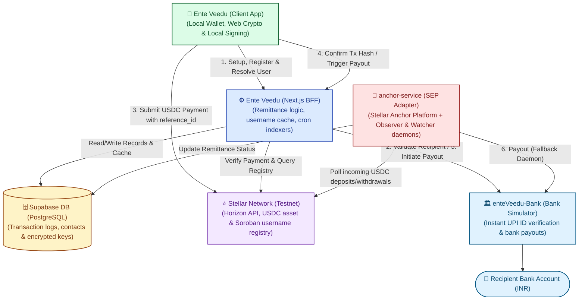
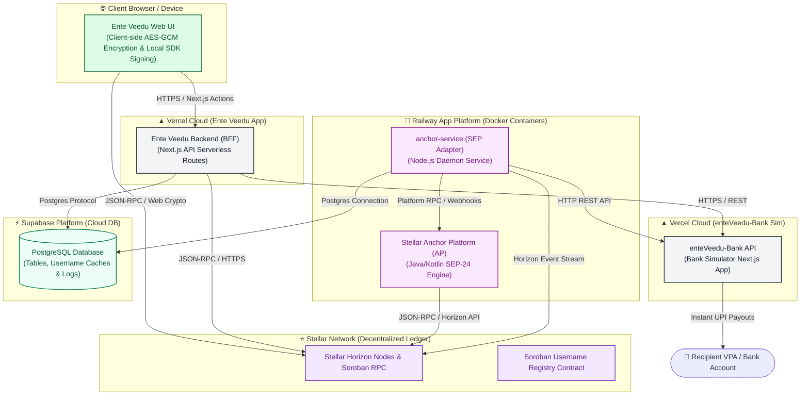
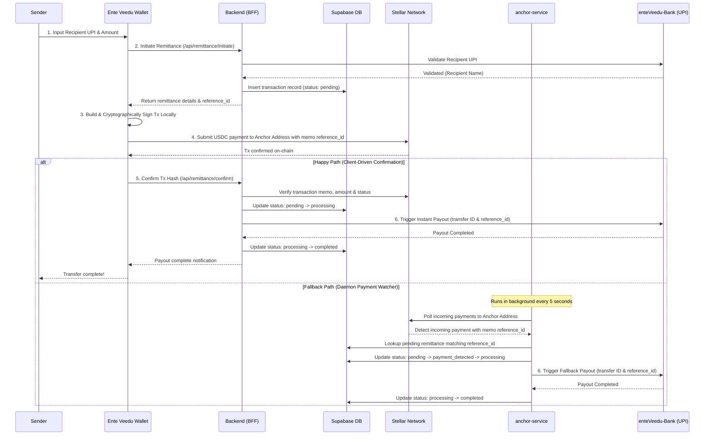

<div align="center">

# 🏡 Ente Veedu

### Fast, secure, and affordable cross-border remittance from the Gulf to Kerala — built on Stellar

[](https://nextjs.org/)
[](https://www.typescriptlang.org/)
[](https://stellar.org/)
[](https://www.circle.com/usdc)
[](#license)

[Live Demo](#-product-demo) · [Features](#-key-features) · [Architecture](#-system-architecture) · [Getting Started](#-getting-started) · [Roadmap](#-roadmap)

</div>

---

## 📖 Overview

**Ente Veedu** ("Ente Veedu" — Malayalam for _"my home"_) is a blockchain-powered remittance platform that lets Gulf-based expatriates send money home to Kerala in seconds, not days. It uses the **Stellar network** and **USDC** as a settlement layer, paired with a custom Anchor implementation that bridges digital assets to real bank accounts — so users get the speed and cost benefits of blockchain rails without ever needing to understand blockchain.

## 🎯 The Problem

Millions of expatriates send money home every month. Today, that process is:

| Pain Point                 | Impact                                              |
| -------------------------- | --------------------------------------------------- |
| High transaction fees      | Traditional corridors charge 3–7% per transfer      |
| Slow settlement            | Transfers can take hours to multiple business days  |
| Poor exchange transparency | Hidden FX margins on top of stated fees             |
| Multiple intermediaries    | Correspondent banks add cost and delay at every hop |
| Limited accessibility      | Cash pickup and banking-hour dependencies           |

## 💡 The Solution

Ente Veedu replaces the intermediary chain with a single settlement layer: Stellar.


This gives senders **near-instant settlement**, **lower fees**, and **full transfer transparency**, while recipients still get money the way they always have — straight into their bank account.

---

## ✨ Key Features

| Feature                                | Description                                                                  |
| -------------------------------------- | ---------------------------------------------------------------------------- |
| 🌍 **Instant Cross-Border Remittance** | Transfers settle on Stellar in seconds instead of days                       |
| 💸 **Low Transaction Fees**            | Stellar's minimal network fees replace multi-hop correspondent banking costs |
| 💵 **USDC-Powered Stability**          | Settlement in USDC avoids crypto volatility during transfer                  |
| 🏦 **Seamless Bank Integration**       | Deposit and withdraw through a connected Anchor/banking service              |
| 👥 **Beneficiary Management**          | Save and reuse recipient details for faster repeat transfers                 |
| 📜 **Transaction History & Tracking**  | Full visibility into status, timestamps, and blockchain confirmations        |
| 🔒 **Secure Wallet Infrastructure**    | Authenticated sessions, encrypted communication, validated transactions      |
| 🧩 **Modular Architecture**            | Independent Wallet, Anchor, and Bank services for easier scaling             |
| 📱 **Responsive UI**                   | Built with Next.js + Tailwind for a clean cross-device experience            |
| 🚀 **Cloud-Native Deployment**         | Seamless scaling across Vercel and standalone services                       |

---

## 🛠 Tech Stack

| Layer          | Technology                                         |
| -------------- | -------------------------------------------------- |
| **Frontend**   | Next.js, React, TypeScript, Tailwind CSS           |
| **Backend**    | Next.js API Routes, Node.js                        |
| **Blockchain** | Stellar Network, Stellar SDK, Horizon API, Soroban |
| **Database**   | Supabase / PostgreSQL (production)                 |
| **Deployment** | Vercel / Railway                                   |

---

## 🏗 System Architecture

> [!TIP]
> Follow the numbered steps (**1** through **6**) to trace the lifecycle of a remittance transfer. Card colors represent the client app (green), Next.js BFF (blue), database (orange), Stellar blockchain (purple), and the anchor / banking adapters (red & light blue).



### Production Deployment Architecture



### Remitanance Transfer Sequence



---

## ⛓️ Blockchain Integration Details

| Item               | Value                                                                               |
| ------------------ | ----------------------------------------------------------------------------------- |
| Network            | Stellar (Testnet for development, Mainnet for production)                           |
| Settlement Asset   | USDC                                                                                |
| Anchor Standards   | SEP-10 (Web Auth), SEP-24 (Interactive Deposit & Withdrawal)                        |
| Explorer Link      | [Stellar Expert Explorer](https://stellar.expert/explorer/testnet)                  |
| Soroban Usage      | On-Chain Username Registry (stores unique @usernames linked to Stellar Public Keys) |
| Cron Sync Interval | Indexes registration events from Soroban RPC sequence and caches to Supabase        |

---

## 🔐 Security & Compliance

### Client-Side Cryptographic Custody

- Private keys and seeds are generated client-side inside the user's browser.
- Encrypted using **AES-GCM (256-bit)** with **PBKDF2 key derivation (100,000 iterations)**.
- Encrypted payload (salt, IV, ciphertext) is stored in the database for cross-device access.
- **The server never sees or stores plaintext private keys or user passwords**. All transaction signing happens client-side.

### Compliance & Verification Roadmap

- **Jurisdictional Gates:** Allow/Block lists restricting outbound corridors (UAE/GCC) to inbound corridors (Kerala/India).
- **KYC Integration (SEP-12 / Third-Party):** Integration points for customer onboarding, identity document processing, and validation.
- **Sanctions Screening:** Daily screening of senders and recipients against OFAC/UN sanctions lists.
- **MSB Licensing:** Architected to integrate with fully-regulated local financial anchors and U.S./UAE remittance partners.

---

## 🚀 Getting Started

Ente Veedu relies on a multi-service structure to orchestrate client wallets, anchor platforms, and local banking simulations.

### Prerequisites

- Node.js 18+ & npm
- A supabase database with the remittance schemas applied

### 1. Database Setup

Create tables in your database using the migration files:

```bash
# Apply migrations to your Supabase PostgreSQL instance
# supabase-migration-remittance.sql
# supabase-migration-update.sql
```

### 2. Multi-Service Configuration

This repository requires three components running in parallel for full testing:

1. **`stellar-pay` (Ente Veedu)** (Next.js client + BFF)
2. **`anchor-service`** (Anchor observation engine & SEP webhooks)
3. **`bank-sim` (enteVeedu-Bank)** (Simulated bank accounts, balances, and UPI payouts)

#### Run `bank-sim` (enteVeedu-Bank Simulator API)

```bash
cd bank-sim
npm install
npm run dev
# Running on http://localhost:3001
```

#### Run `anchor-service` (Stellar platform daemon)

```bash
cd anchor-service
npm install
npm run dev
# Running on http://localhost:3003
```

#### Run `stellar-pay` (Ente Veedu Main application)

```bash
cd stellar-pay
npm install
cp .env.example .env.local
# Fill in required variables in .env.local
npm run dev
# Running on http://localhost:3000
```

### Environment Variables Template

Create a `.env.local` inside the `stellar-pay` (Ente Veedu) directory:

```env
# Stellar network config
NEXT_PUBLIC_STELLAR_NETWORK=testnet
NEXT_PUBLIC_HORIZON_URL=https://horizon-testnet.stellar.org
NEXT_PUBLIC_RPC_URL=https://soroban-testnet.stellar.org
NEXT_PUBLIC_FRIENDBOT_URL=https://friendbot.stellar.org

# USDC Asset Configuration
NEXT_PUBLIC_USDC_ISSUER=GAJ553PWUPQDOJBP33JKEHXJXCGT5QTU7U245Y243MMQUA4QBQIJ55ND

# Sponsor / Registry Contract ID
NEXT_PUBLIC_REGISTRY_CONTRACT_ID=CDY...
SPONSOR_SECRET_KEY=S...

# Database Configuration (Supabase)
NEXT_PUBLIC_SUPABASE_URL=https://your-project.supabase.co
NEXT_PUBLIC_SUPABASE_ANON_KEY=eyJ...
SUPABASE_SERVICE_ROLE_KEY=ey...

# Bank Simulator Connection
BANK_URL=http://localhost:3001
BANK_API_KEY=your-bank-api-key

# Cron Secret for Indexer Authorization
CRON_SECRET=your-cron-secret
```

---

## 📁 Project Structure

```
stellar-pay (Ente Veedu)/
├── src/
│   ├── app/                # Pages & BFF API Routes
│   │   ├── api/            # API Endpoints (faucet, register, remittance, resolve)
│   │   └── layout.tsx
│   ├── components/         # SendMoneyModal, Onboarding, BalanceCard, etc.
│   ├── context/            # WalletContext.tsx (Web Crypto & SDK core state)
│   ├── hooks/              # custom React hooks (useFreighter.ts)
│   └── lib/                # Adapters & Services
│       ├── services/       # bankService, exchangeRateService, remittanceService
│       ├── crypto.ts       # Browser PBKDF2/AES-GCM encryption
│       ├── stellar.ts      # Horizon client instances & balance query logic
│       └── wallet.ts       # Local storage wallet helpers
```

---

## 🎬 Product Demo

|                      |                                           |
| -------------------- | ----------------------------------------- |
| **Live Application** | `https://ente-veedu.vercel.app`           |
| **Demo Video**       | `https://youtu.be/ente-veedu-walkthrough` |

---

## 🗺 Roadmap

### Completed Features

- [x] Client-side encrypted non-custodial wallet generation (AES-GCM / PBKDF2).
- [x] Live exchange rates with automatic 30s locked quote refreshes.
- [x] Integrated real-time UPI ID validation against the bank simulator.
- [x] On-chain registry indexing daemon to query custom @usernames on Soroban.
- [x] Automatic payment-watcher daemon for out-of-sync / offline transactions.

### Future Work

- [ ] Direct MoneyGram Access endpoints for local cash pick-up.
- [ ] Multi-currency support (AED, SAR, QAR to INR).
- [ ] Non-custodial freighter wallet hardware link.
- [ ] Advanced AI-powered transaction risk scoring.

---

## 🤝 Contributing

Contributions, issues, and feature requests are welcome. Feel free to open an issue or submit a pull request.

## 👥 Contributors

- **Robert Reji**
- Team Ente Veedu

## 📄 License

This project is licensed under the [MIT License](LICENSE).
