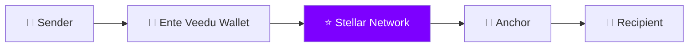
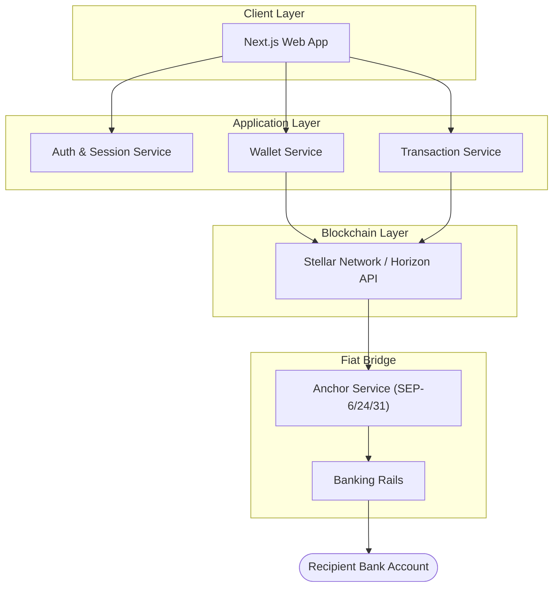
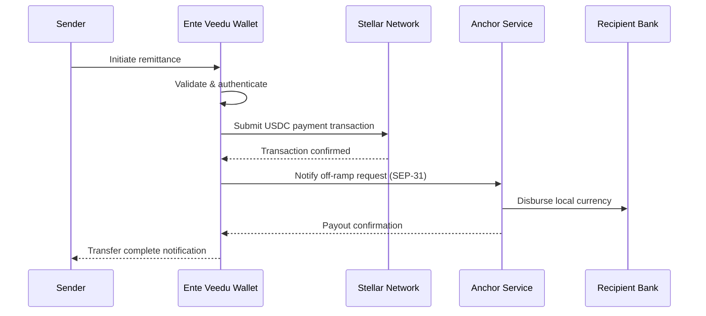

<div align="center">

# 🏡 Ente Veedu

### Fast, secure, and affordable cross-border remittance from the Gulf to Kerala — built on Stellar

[](https://nextjs.org/)
[](https://www.typescriptlang.org/)
[](https://stellar.org/)
[](https://www.circle.com/usdc)
[](#license)

[Live Demo](#-product-demo) · [Features](#-key-features) · [Architecture](#-system-architecture) · [Getting Started](#-getting-started) · [Roadmap](#-roadmap)

</div>

---

## 📖 Overview

**Ente Veedu ** ("Ente Veedu" — Malayalam for *"my home"*) is a blockchain-powered remittance platform that lets Gulf-based expatriates send money home to Kerala in seconds, not days. It uses the **Stellar network** and **USDC** as a settlement layer, paired with a custom Anchor implementation that bridges digital assets to real bank accounts — so users get the speed and cost benefits of blockchain rails without ever needing to understand blockchain.

## 🎯 The Problem

Millions of expatriates send money home every month. Today, that process is:

| Pain Point | Impact |
|---|---|
| High transaction fees | Traditional corridors charge 3–7% per transfer |
| Slow settlement | Transfers can take hours to multiple business days |
| Poor exchange transparency | Hidden FX margins on top of stated fees |
| Multiple intermediaries | Correspondent banks add cost and delay at every hop |
| Limited accessibility | Cash pickup and banking-hour dependencies |

## 💡 The Solution

Ente Veedu replaces the intermediary chain with a single settlement layer: Stellar.


This gives senders **near-instant settlement**, **lower fees**, and **full transfer transparency**, while recipients still get money the way they always have — straight into their bank account.

---

## ✨ Key Features

| Feature | Description |
|---|---|
| 🌍 **Instant Cross-Border Remittance** | Transfers settle on Stellar in seconds instead of days |
| 💸 **Low Transaction Fees** | Stellar's minimal network fees replace multi-hop correspondent banking costs |
| 💵 **USDC-Powered Stability** | Settlement in USDC avoids crypto volatility during transfer |
| 🏦 **Seamless Bank Integration** | Deposit and withdraw through a connected Anchor/banking service |
| 👥 **Beneficiary Management** | Save and reuse recipient details for faster repeat transfers |
| 📜 **Transaction History & Tracking** | Full visibility into status, timestamps, and blockchain confirmations |
| 🔒 **Secure Wallet Infrastructure** | Authenticated sessions, encrypted communication, validated transactions |
| 🧩 **Modular Architecture** | Independent Wallet, Anchor, and Bank services for easier scaling |
| 📱 **Responsive UI** | Built with Next.js + Tailwind for a clean cross-device experience |
| 🚀 **Cloud-Native Deployment** 

---

## 🛠 Tech Stack

| Layer | Technology |
|---|---|
| **Frontend** | Next.js, React, TypeScript, Tailwind CSS |
| **Backend** | Next.js API Routes, Node.js |
| **Blockchain** | Stellar Network, Stellar SDK, Horizon API, Soroban |
| **Database** | SQLite (development) → Supabase / PostgreSQL (production) |
| **Deployment** | Vercel |

---

## 🏗 System Architecture



### Transfer Sequence



> **Note for judges/reviewers:** static diagram exports (PNG) can be added at `docs/architecture/` if your submission format requires image files rather than rendered Markdown — Mermaid renders natively on GitHub, so no extra tooling is needed to view these as-is.

---

## ⛓️ Blockchain Integration Details

| Item | Value |
|---|---|
| Network | Stellar (Testnet for development, Mainnet for production) |
| Asset | USDC |
| Anchor Standards | SEP-6 / SEP-24 (deposit/withdraw), SEP-31 (direct payments) |
| Explorer | [stellar.expert](https://stellar.expert/) |
| Soroban Usage | *(Fill in — e.g. escrow logic, compliance checks, or fee routing, if applicable)* |
| Mainnet Contract ID | `TODO — add before production deployment` |

> ⚠️ Fill in the Soroban contract's actual purpose and mainnet address before this goes to judges — an unexplained "smart contract" line without a concrete role can read as unfinished rather than in-progress.

---

## 🔐 Security & Compliance

**Implemented / in progress:**
- Authenticated API access with session management
- Wallet operations gated behind validated, authenticated requests
- Transaction validation before submission to the network

**Compliance roadmap (required for a live remittance product):**
- KYC/AML identity verification for senders and recipients
- Sanctions and PEP screening
- Transaction monitoring and reporting thresholds
- Applicable licensing (e.g. Money Services Business / Payment Institution license, per jurisdiction) — including RBI/FEMA considerations for inbound India remittances

> These are flagged intentionally rather than glossed over: for a remittance product specifically, judges and regulators alike will ask about this first. Documenting the roadmap honestly is stronger than implying it's already solved.

---

## 🚀 Getting Started

### Prerequisites
- Node.js 18+
- npm
- A Stellar testnet account (for local development)

### Setup

```bash
# 1. Clone the repository
git clone https://github.com/Ente-Veedu/Ente_Veedu_Wallet.git
cd Ente_Veedu_Wallet

# 2. Install dependencies
npm install

# 3. Configure environment variables (see below)
cp .env.example .env.local

# 4. Run the development server
npm run dev
```

Visit **http://localhost:3000**

### Environment Variables

Create a `.env.local` file:

```env
# Stellar network config
NEXT_PUBLIC_STELLAR_NETWORK=testnet
NEXT_PUBLIC_HORIZON_URL=https://horizon-testnet.stellar.org

# Database
DATABASE_URL=

# Auth / secrets
SECRET_KEY=
```

### Connecting the Anchor Service
Once running locally, configure the Anchor endpoint used for deposits/withdrawals in your environment file or admin settings, then you're ready to send and receive test transactions.

---

## 📁 Project Structure

```
ente-veedu-wallet/
├── app/              # Next.js app router pages & API routes
├── components/       # Reusable UI components
├── lib/              # Stellar SDK helpers, Anchor client, utilities
├── hooks/            # Custom React hooks
├── public/           # Static assets
├── styles/           # Global styles / Tailwind config
├── docs/             # Architecture & contract documentation
└── src/              # Shared source (if applicable)
```

---

## 🎬 Product Demo

| | |
|---|---|
| **Live Application** | `https://YOUR-VERCEL-LINK.vercel.app` |
| **Demo Video** | `https://youtu.be/YOUR_VIDEO` |

> ⚠️ Replace both links before submission — a working live link is usually worth more to judges than any other section of this README.

---

## 🗺 Roadmap

- [ ] Production banking integrations
- [ ] UPI integration
- [ ] MoneyGram Access integration
- [ ] Multi-currency support
- [ ] Real-time exchange rates
- [ ] Mobile applications
- [ ] QR payments
- [ ] Merchant payments
- [ ] Non-custodial wallet support
- [ ] AI-powered fraud detection
- [ ] Global remittance corridors beyond India

---

## 🤝 Contributing

Contributions, issues, and feature requests are welcome. Feel free to open an issue or submit a pull request.

## 👥 Contributors

- **Robert Reji**
- Team Ente Veedu

## 📄 License

This project is licensed under the [MIT License](LICENSE).